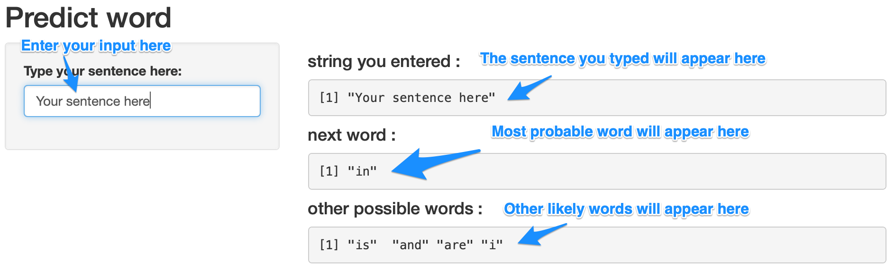

```{r setup, include=FALSE}
knitr::opts_chunk$set(echo = FALSE)
```

## Capstone Project Overview

- Goal: create an easy to use Word Prediction web application  
- Prediction Model: Maximum Likelihoood estimation with Kneser-Ney Smoothing  
- The application URL: [Click Here](https://jinkwanh.shinyapps.io/Capstone/)

## Data Cleansing and Modeling

- Source Data: [Coursera-Swiftkey Capstone Project](https://d396qusza40orc.cloudfront.net/dsscapstone/dataset/Coursera-SwiftKey.zip)
- Cleansing Method: Remove punctuation, twitter hashtags, numbers, hyphens, symbols other than English alphabet, URLs.
- Model: N-Gram Modeling and Kneser-Ney smoothing

## Maximum Likelihood Estimation(MLE) and Kneser-Ney Smoothing

- MLE: When words A-B-C are present, the predicted word C is determined by the conditional probability of P(C | A and B). When there are multiple options, the application uses the most likely word as predicted word.
- KN Smoothing
  - The problem with MLE is that when the word combination does not exist it can't predict the word. 
  - To mitigate the problem the application uses Kneser-Ney Smoothing. 
  - Discount the probability from the word appeared frequently and distribute the probabilty to N-1 gram words based on N-1 gram words frequency. 

## How to Use the Application

```{r, out.width = "800"}

```

## Further Consideration

- More N-gram: current model has up to quad-gram. For more precision, it can be extended to more. The limitation is that the more N-gram there is more computation power required.
- Deep Learning(RNN): Known to be good at predicting next words. However R is not suitable for Deep Learning algorithm and most of us don't have computing resource for good RNN model. If resource allows, it could be the best solution. 

